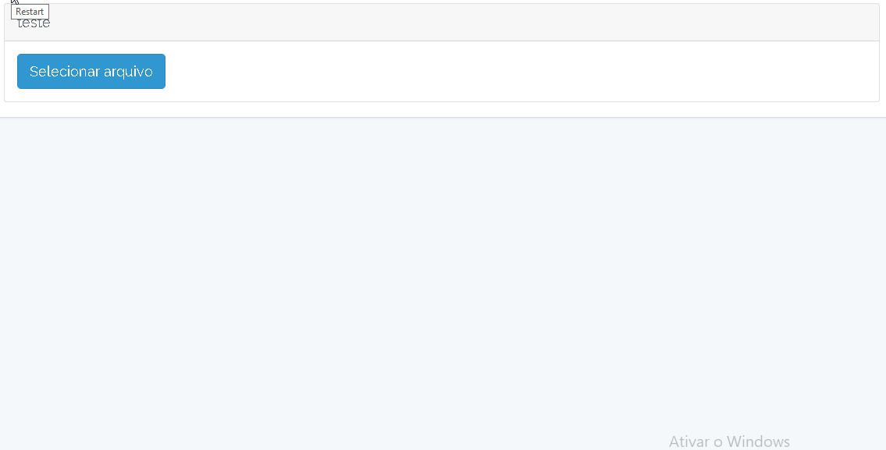

# FileUpload Vue
<a href='https://github.com/shivamkapasia0' target="_blank"></a>
## File upload with Vue component and Axios



### Usage example

Prerequisites:
Bootstrap 4 (css only)
Font-Awesome (for icons, not required)

Props   | default  | obs
--------|----------|------------------------------- 
title   | null     | untitled only the button appears
action  | null     | **Required** resource url
:ext    | null     | Array with valid extensions
:unique | false    | If true, it is possible to upload only one field
params  | null     | more information in the route before the resource

**Vue Configuration**

If you haven't started Vue, run the commands:

```
npm install
```

**Note: Vue needs to have a tag with id="app" or another one defined inside resources/assets/js/app.js in the Vue object in el: '#app'**

In the resources/assets/js folder clone this repository:

```
git clone https://github.com/EmersonBraun/fileupload-vue.git
```

Register the component in resources/assets/js/app.js


```
Vue.component('file-upload', require('./fileupload-vue/FileUpload.vue'));
```

Call example:

```
<file-upload
    title="Files"
    action="fileupload"
    :ext="['png','jpeg','jpg']"
    :unique="true"
    params="/admin"
    >
</file-upload>
```